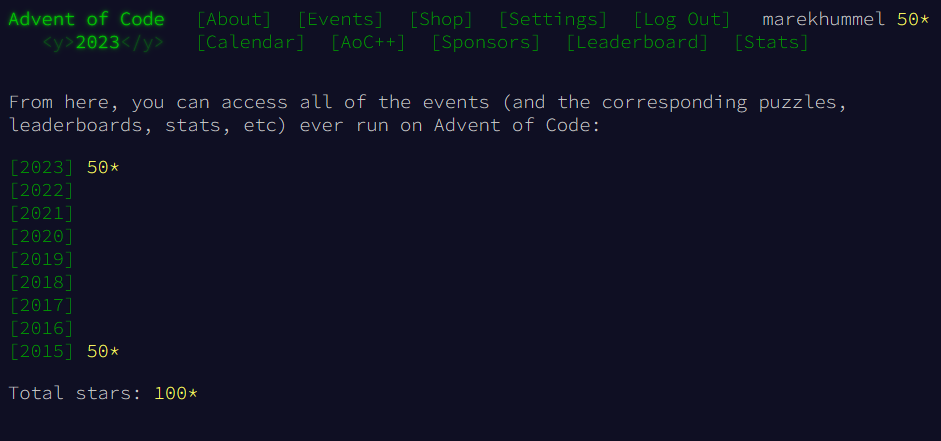

# Advent Of Code
Advent Of Code solutions.
Currently contains solutions for 2023 and 2015, mostly solved in Rust.

To run, check the main files per year in each languages' directory. There are general entry points for each year in Rust, for 2023 there is also one for Python. Moreover, there can be single day solutions in any other language, like 2015-07 in Golang which has to be called directly.

Run them and pass either `dayXX` as an argument or `main` to run all of them.
- Rust: `cargo run --release --bin mainYYYY -- dayXX` (or `main` instead of the day)
- Python: `python -u ./YYYY/python/main.py dayXX`

Within the main files there are three config flags which are relevant when running a single day. Use `VERSION` to select part 1 or 2 and `USE_SAMPLE` to choose between sample or real input. Set `ALL` to true to run through all 4 results of that day.

### Total Progress
