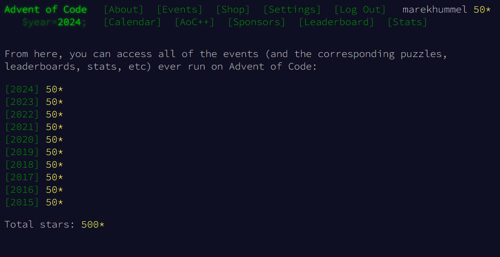

# Advent Of Code
Advent Of Code solutions.
Contains solutions for all years from 2015 to 2023 (2024 ongoing), all of them solved in Rust.
Addionally, there are some extra implementations in python (2023), golang (2015-07, 2016-10) and zig (2024).

Note thatmostly for rust and a bit for zig it made sense to implement a library for reusage of code and structures and what not. Nonetheless the important part of each day should still be in the respective daily file. Moreover, both rust and zigs daily files contain the solution values for that day, so that unit tests can check if some code broke a specific day.

### Run
To run, check the main files per year in each languages' directory. There are general entry points for each year in Rust, for 2023 there is also one for Python and for 2024 there is one for zig. Golang only has single single day solutions and needs to be called directly.

Run them and pass either `dayXX` as an argument or `main` to run all of them.
- Rust: `cargo run --release --bin mainYYYY -- dayXX`
- Python: `python -u ./2023/python/main.py dayXX`
- Zig: `(zig build -Doptimize=ReleaseFast 2024_main) && (./zig-out/bin/main2024.exe dayXX)`

Within the main files there are three config flags which are relevant when running a single day. Use `VERSION` to select part 1 or 2 and `USE_SAMPLE` to choose between sample or real input. Set `ALL` to true to run through all 4 results of that day.

### Scripts
For development, there are two scripts to create rust or zig template files for a new [day](./scripts/new_day.sh) (pass year, day and lang as args) or the directory structure for a new [year](./scripts/new_year.sh) (rust only).

Moreover, a script to [download all inputs](./scripts/download_inputs.sh) for a given year, or just a specific day if given two args (year day).

It makes sense to use [pre-commit.py](./scripts/pre-commit.py) as a precomit hook, which runs all unit tests for the days in rust in the stating area prior to commiting. Zig has unit tests as well, but only one per year and currently has to be invoked manually with `zig test 2024_test`.

Lastly, there is a script to [verify solutions](./scripts/verify_results.sh).
Basically it checks the results mentioned in the rust file for unit tests with the solutions submitted to the platform.

Since input files are different for each user, make sure to create a file `./scripts/aoc_cookie.txt` which contains your session cookie, before running the scripts. Check your browser's storage for that.

### Total Progress

